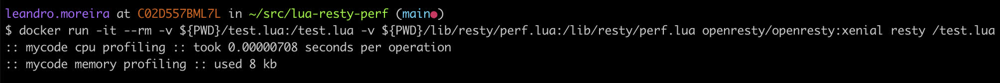

# Resty Perf

A simple resty lua library to benchmark memory and throughput of a function.

```lua
local function mycode()
  local x = {}
  for i = 1, 1e3 do
    local now = ngx.now()
    now = now - 45 + i
    x[i] = now
  end
  return x
end

perf.perf_time("mycode cpu profiling", mycode)

perf.perf_mem("mycode memory profiling", mycode)
```
To run it, you can use the openresty docker image:

```bash
docker run -it --rm -v ${PWD}/test.lua:/test.lua -v ${PWD}/lib/resty/perf.lua:/lib/resty/perf.lua openresty/openresty:xenial resty /test.lua
```



# Installing

The module is available at [luarocks.](https://luarocks.org/modules/leandro/lua-resty-perf)

```bash
luarocks install lua-resty-perf
```
